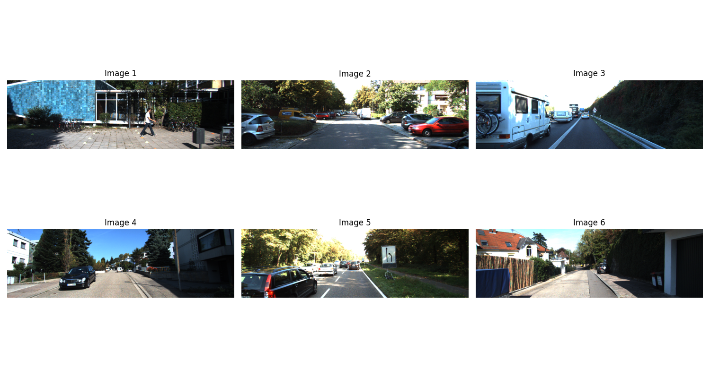

# Monocular Depth Estimation Using Deep Learning

This project implements a convolutional neural network (CNN) for monocular depth estimation using the KITTI dataset. The model is trained to predict a per-pixel depth map from a single RGB image. Ground truth depth maps are derived from LiDAR data collected by a Velodyne scanner and projected onto the image plane using camera calibration. These maps are encoded as 16-bit grayscale images, where each pixel value represents depth in meters scaled by a factor of 256. While a CNN can technically output any grayscale image, this model is specifically trained to produce grayscale maps where each pixel value has a physically meaningful interpretation — representing the actual distance (in meters) to that part of the scene. During training, the model learns to associate visual cues in RGB images (such as texture, size, and perspective) with real-world distance by comparing its predictions to LiDAR-based depth maps. At inference time, the trained model takes a new RGB image and outputs a single-channel depth map, which can be converted to metric depth by dividing pixel values by 256. This setup enables pixel-wise 3D scene understanding from a single camera frame.
### 📊 Monocular Depth Estimation Flow

This diagram illustrates the model's transformation of a single RGB image into a metrically meaningful depth map:


---

## 🚀 Project Structure

monocular-depth-estimation/  
├── data/                          # Dataset folder (kept empty here; see below)  
├── models/  
│   └── depth_cnn.py              # Simple CNN model for depth prediction  
├── notebooks/  
│   └── 01_load_data_and_visualize.ipynb  # Data loading and training code  
├── utils/  
│   └── dataset.py                # Custom PyTorch Dataset class  
├── view_sample_image.py          # Script to visualize images outside Jupyter  
├── create_tiny_subset.py         # Script to create a tiny dataset subset  
├── requirements.txt              # Python dependencies  
├── README.md                     # Project description and instructions  
└── .gitignore                    # Files to ignore when pushing to GitHub

---

## 📥 How to Set Up

1. **Clone the repository:**
    ```bash
    git clone https://github.com/Arman-Rajaei/monocular-depth-estimation.git
    cd monocular-depth-estimation
    ```

2. **Install dependencies:**
    ```bash
    pip install -r requirements.txt
    ```

3. **Download KITTI sample dataset:**
    - Download a few images from the KITTI Raw Dataset (or use your own images).
    - Place them into the folder:
      ```
      data/kitti_tiny/training/image_2/
      ```
    - Make sure all images are resized automatically inside the code.

4. **(Optional)** Create a tiny subset using:
    ```bash
    python create_tiny_subset.py
    ```

---

## 🏋️ How to Train

- Open the Jupyter Notebook:
    ```bash
    jupyter notebook
    ```
- Navigate to:
    ```
    notebooks/01_load_data_and_visualize.ipynb
    ```
- Run the notebook to train the depth estimation model for a few epochs.

✅ The model uses a lightweight CNN and L1 Loss to predict a grayscale depth map.

---

## 📈 Sample Results

- The model output is a single-channel depth map corresponding to input RGB images.
- Since this is a demonstration, the loss decreases steadily during training.

---

## 📷 Sample Visualization

Here are a few input images from the KITTI dataset used during training:



---

## 🛠 Future Improvements

- Train using real ground truth depth maps from KITTI.
- Improve model architecture with skip connections (e.g., U-Net structure).
- Test on larger datasets.
- Deploy lightweight model to mobile or embedded platforms.

---

## 📜 License

This project is open for personal and research usage.

---

## ✨ Acknowledgements

- [KITTI Dataset](http://www.cvlibs.net/datasets/kitti/)
- PyTorch Community
